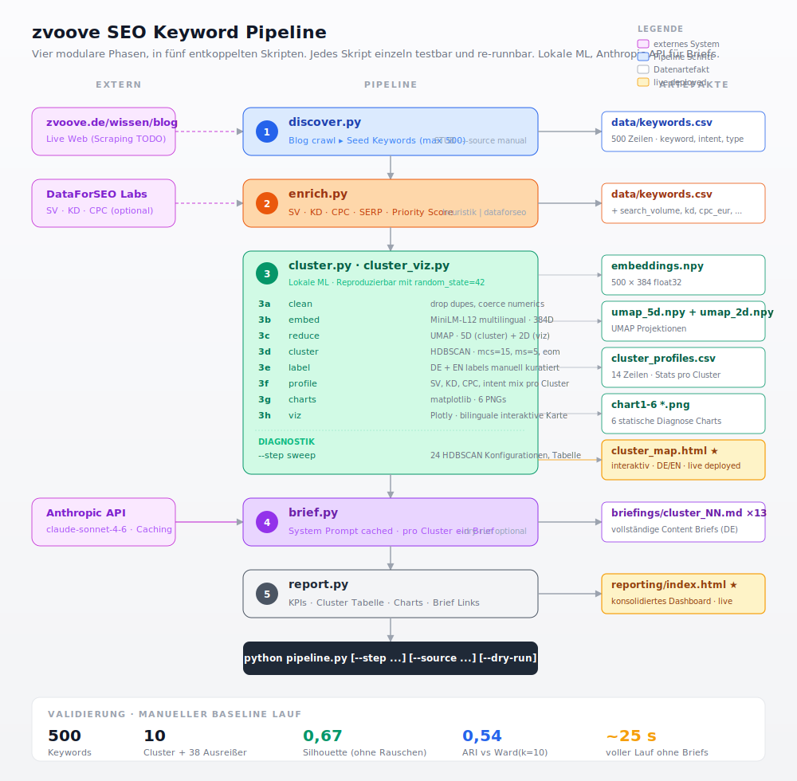

# SEO Keyword → ContentBrief Pipeline für zvoove

Eine Pipeline, die aus dem zvoove Blog ein priorisiertes Keyword Set, thematische Cluster, Content Briefs und ein interaktives Reporting macht.



> Vier modulare Phasen, in sechs entkoppelten Skripten implementiert. Externe Systeme links, lokale ML in der Mitte, Datenartefakte rechts. Die markierten Artefakte sind über GitHub Pages live verfügbar. Detail in [`docs/architecture.md`](docs/architecture.md).

## Das Problem in einem Satz

Das Ziel ist es, im Bereich Zeitarbeit und Personaldienstleistung organischen Traffic zu gewinnen, der echte Kaufinteressenten bringt. Dafür braucht es eine klare Antwort auf die Frage: Welche Themen lohnen sich wirklich, und in welcher Reihenfolge?

## Was diese Pipeline tut

```
Discover -> Enrich    -> Cluster        -> Labels       -> Brief       -> Report      -> Export
Blog        SV/KD/CPC    HDBSCAN +         Anthropic       Claude API     Dashboard      JSON + CSV
zvoove.de   Heuristik    Soft-Assign       Haiku Batch     pro Cluster    konsolidiert   Airtable / Sheets
            DataForSEO   alle 500 in 13    DE/EN labels    ein Brief      alle Schritte  Notion / Looker
                         Cluster, 0 out
```

Sie nimmt den bestehenden Blog [zvoove.de/wissen/blog](https://zvoove.de/wissen/blog), entwickelt daraus bis zu 500 thematisch passende Keywords, gruppiert sie automatisch nach Bedeutung, schreibt für jede Gruppe einen Content Brief und liefert ein interaktives Dashboard mit Empfehlungen.

## Schnelle Einstiegspunkte

| Was | Wo |
|---|---|
| Interaktive Cluster Karte (Live) | [t1nak.github.io/seo-pipeline/output/clustering/cluster_map.html](https://t1nak.github.io/seo-pipeline/output/clustering/cluster_map.html) |
| Konsolidierter Report (Live) | [t1nak.github.io/seo-pipeline/output/reporting/index.html](https://t1nak.github.io/seo-pipeline/output/reporting/index.html) |
| Beispiel Content Brief | [`output/briefings/cluster_05.md`](output/briefings/cluster_05.md) |
| Cluster Profile (CSV) | [`output/clustering/cluster_profiles.csv`](output/clustering/cluster_profiles.csv) |
| Methodische Begründung | [`docs/methodology.md`](docs/methodology.md) |
| Vollständige Case Study | [`CASE_STUDY.md`](CASE_STUDY.md) |

## Ergebnisse aus dem aktuellen Lauf

- 500 Keywords (Cap aus 504 manuellem Baseline-Set), 13 thematische Cluster, **0 Outlier** bei `mcs=10, ms=5, eom` plus Soft-Assignment der HDBSCAN-Rand-Keywords ([ADR-15](docs/decisions.md))
- Gesamt Suchvolumen: 239.976 pro Monat (geschätzt, alle Cluster zusammen)
- Größter Cluster nach SV: HR Software Dokumenten- und Mitarbeiterverwaltung (45.567 SV / Monat, 45 Keywords)
- Höchste kommerzielle Dichte: Zvoove Produkte und Features (97 Prozent kommerziell, 23.604 SV)
- Cluster-Labels werden pro Lauf von Anthropic Haiku erzeugt (siehe [`docs/decisions.md`](docs/decisions.md) ADR-5), `data/cluster_labels.yaml` bleibt als Fallback für Demo-Läufe ohne API-Key
- Methodische Validierung: Silhouette 0,647 auf den 428 HDBSCAN-Kern-Keywords, 0,570 inklusive der 72 Soft-Assignments. ARI gegen Ward(k=10): 0,811. Details in [`docs/methodology.md`](docs/methodology.md)
- Frühere Läufe (z.B. `mcs=15/leaf` mit 130 Outliern oder `mcs=12/eom` mit 188-Sammelcluster) sind als Snapshots in `output/_archive/` gepinnt

## Aktueller Stand

Diese Pipeline läuft end-to-end auf einem zuvor LLM-erzeugten Keyword Set. Der Discover Schritt scrapt den Blog noch nicht live, sondern liest die kuratierte Datei `data/keywords.manual.csv`. Das ist transparent dokumentiert in [`docs/decisions.md`](docs/decisions.md) und der nächste hochwertige Arbeitsblock.

| Schritt | Stand |
|---|---|
| Discover | Stub. `--source manual` funktioniert, `--source live` ist offen |
| Enrich | Vollständig. Heuristik plus optional DataForSEO Live Lookup |
| Cluster | Vollständig. Embeddings, UMAP, HDBSCAN, Soft-Assignment, Profiling |
| Labels (LLM) | Vollständig. Anthropic Haiku Batch-Call, JSON pro Lauf, YAML-Fallback |
| Brief | Vollständig. Claude API mit Prompt Caching |
| Report | Vollständig. Charts, Cluster-Map, konsolidiertes HTML Dashboard |
| Export | Vollständig. JSON plus CSV pro Cluster und pro Keyword. Airtable-Sync via `python -m src.sync_airtable`, Google-Sheets-Push via `python -m src.sync_sheets` (Schalter `PIPELINE_SHEETS_SYNC_ENABLED`) |

## Schnellstart

```bash
# Abhängigkeiten installieren
pip install -r requirements.txt

# Optional: Dev-Tools für Tests
pip install -r requirements-dev.txt
pytest                                     # 21 Tests, < 1 Sekunde

# Komplette Pipeline ausführen
python pipeline.py

# Einzelne Schritte
python pipeline.py --step cluster
python pipeline.py --step brief --dry-run    # ohne Claude API
python pipeline.py --step report
python pipeline.py --step export              # JSON + CSV für Airtable/Notion/Sheets

# Optional: direkt nach Airtable synchronisieren (Token + Base nötig, siehe docs/reporting-integration.md)
export AIRTABLE_TOKEN=patXXX AIRTABLE_BASE_ID=appXXX
python -m src.sync_airtable --print-schema    # Feldnamen für die Airtable-Tabellen
python -m src.sync_airtable                   # voller Sync

# Optional: direkt nach Google Sheets pushen (Service Account + Sheet-ID nötig)
export PIPELINE_SHEETS_SYNC_ENABLED=true PIPELINE_SHEETS_ID=1AbC...
export GOOGLE_SHEETS_CREDENTIALS_FILE=/Pfad/zu/service-account.json
python -m src.sync_sheets                     # voller Push

# Cluster Sub-Schritte einzeln
python -m src.cluster --step embed,reduce,cluster,label,profile
python -m src.cluster --step sweep            # diagnostischer Hyperparameter Sweep

# LLM-Labels nach dem Cluster-Schritt (braucht ANTHROPIC_API_KEY)
python -m src.labels_llm                      # Default: claude-haiku-4-5
python -m src.labels_llm --model claude-sonnet-4-6
```

Für echte Content Briefs (sonst Stubs) wird ein Anthropic API Key gebraucht:

```bash
export ANTHROPIC_API_KEY=sk-ant-...
python pipeline.py --step brief
```

Für Live Keyword Daten statt Heuristik:

```bash
export DATAFORSEO_LOGIN=...
export DATAFORSEO_PASSWORD=...
python pipeline.py --step enrich --provider dataforseo
```

## Repo Struktur

```
seo-pipeline/
├── README.md              dieses Dokument
├── CASE_STUDY.md          ausführliche Schreibarbeit zum Vorgehen
├── pipeline.py            Orchestrator für die sechs Pipeline-Schritte
├── requirements.txt
├── data/
│   ├── keywords.csv             aktueller Stand (überschreibbar durch discover)
│   ├── keywords.manual.csv      kuratierter Baseline Datensatz, bleibt frozen
│   └── cluster_labels.yaml      Fallback-Labels für Demo-Läufe ohne API-Key
├── docs/
│   ├── methodology.md     warum HDBSCAN, warum UMAP, Parameter Sweep, Validierung
│   ├── results.md         Cluster Katalog mit Revenue Empfehlung
│   ├── architecture.md    Pipeline Diagramm, Datenfluss, Integration
│   ├── developer-guide.md Repo-Struktur, Konfiguration, Erweiterungs-Rezepte
│   └── decisions.md       Architecture Decision Records, knappe ADRs
├── output/
│   ├── clustering/        Embeddings, UMAP, cluster_labels.json, Profiles
│   ├── briefings/         Content Briefs als Markdown (1 pro Cluster)
│   ├── reporting/         konsolidiertes Dashboard, Charts, Cluster-Map, JSON-Export
│   └── _archive/          gepinnte Snapshots vergangener Läufe
├── src/
│   ├── discover.py        Blog -> Seed Keywords (STUB)
│   ├── enrich.py          SV / KD / CPC / Priority
│   ├── cluster.py         Pipeline (clean, embed, UMAP, HDBSCAN, label-Stub, profile)
│   ├── cluster_viz.py     interaktive bilinguale Plotly Karte
│   ├── labels_llm.py      DE/EN Cluster-Labels per Anthropic Haiku Batch-Call
│   ├── brief.py           Content Briefs via Claude API
│   ├── report.py          konsolidiertes Reporting, Charts, Cluster-Map
│   ├── export.py          JSON + CSV für Airtable, Notion, Google Sheets
│   ├── sync_airtable.py   direkter Upload der JSONs in eine Airtable-Base
│   └── sync_sheets.py     direkter Push in ein Google Sheet (Service Account, on/off-Schalter)
└── tests/
```

## Tech Stack

| Schicht | Werkzeug | Warum |
|---|---|---|
| Embeddings | `sentence-transformers/paraphrase-multilingual-MiniLM-L12-v2` | mehrsprachig, läuft lokal ohne GPU, ausreichend für deutsche Keywords |
| Dimensionsreduktion | `umap-learn` | bessere lokale Struktur als PCA für density-based clustering |
| Clustering | `hdbscan` | wählt Clusteranzahl selbst, markiert Ausreißer als Rauschen statt Zwangszuordnung |
| Hierarchischer Vergleich | `scipy.cluster.hierarchy` (Ward) | transparente Granularitätskontrolle für Stakeholder, plus ARI als Gegenprobe |
| Visualisierung | `plotly` (interaktiv), `matplotlib` (PNG) | Plotly für die HTML Karte mit Klick und Sprache, matplotlib für die statischen Diagnose Charts |
| LLM Briefs | `anthropic` SDK, `claude-sonnet-4-6` | mit Prompt Caching auf System Block, ungefähr 90 Prozent Token Ersparnis bei wiederholten Läufen |
| Live Keyword Daten | DataForSEO Labs API | optional, Heuristik als Default |

## Was noch fehlt

- Keine direkte Anbindung an einen Search Console Account. Wenn echte Click und Impression Daten gewünscht sind, ist das eine Erweiterung des Discover Schritts.
- Kein Auto-Publishing der Briefs in ein CMS. Die Briefs sind Markdown, eine Anbindung an Sanity, Contentful oder WordPress wäre ein eigener Schritt.
- Kein Tracking der Pipeline Läufe in einer Datenbank. Für Produktion wäre ein einfacher SQLite Run-Log sinnvoll, aktuell sind Snapshots die Persistenz Schicht.

Diese Lücken sind dokumentiert in [`docs/decisions.md`](docs/decisions.md).

## Lizenz und Kontext

Persönliches Case Study Projekt im Rahmen einer Bewerbung als Revenue AI Architect bei zvoove. Nicht offiziell affiliated.
