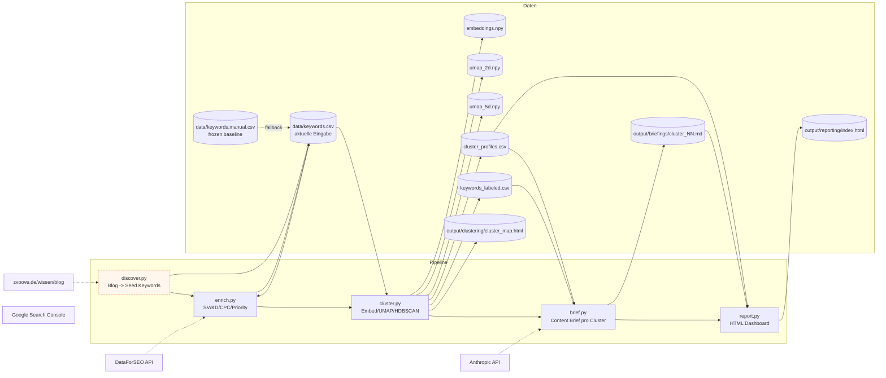

# Prozessarchitektur

Diese Datei beschreibt den Datenfluss durch die Pipeline, die Schnittstellen zwischen Schritten und die Anbindung an einen Revenue Stack. In 10 Minuten verständlich aufgebaut.

## Pipeline auf einen Blick


Vier modulare Phasen, an jeder Stelle sind Provider per Konfiguration austauschbar (Keyword-Quelle, LLM für Briefings, Reporting-Ziel). Auslöser: GitHub Actions per Cron-Schedule oder manueller Trigger.

## Implementierungs-Detail

Die folgende SVG zeigt links die externen Provider (jede Spalte mit den heute aktiven und alternativen Optionen), in der Mitte die fünf entkoppelten Skripte (Discover, Enrich, Cluster, Brief, Report) mit den jeweiligen Sub-Schritten von `cluster.py`, rechts die produzierten Datenartefakte. Diese fünf Skripte realisieren die vier modularen Phasen aus dem Diagramm oben; Discover und Enrich liegen heute als zwei Skripte vor, weil das Discover-Stub auf Heuristik arbeitet, würden bei Providern wie SEMrush oder DataForSEO mit erweitertem Endpoint aber zusammenfallen. Markierte Artefakte (★ gelb) sind über GitHub Pages live deployed.

[](architecture.svg){target=_blank title="Klick öffnet das Diagramm in voller Größe"}

*Klick auf das Diagramm öffnet es in voller Auflösung in einem neuen Tab.*

Für eine Mermaid Quelle, die in jedem GitHub Markdown Renderer funktioniert, hier dieselbe Struktur als Code:



Legende: violett umrandet sind externe APIs, orange gestrichelt ist der Discover Stub, der noch nicht live ist.

## Schichten und Verantwortlichkeiten

| Schicht | Modul | Verantwortlich für |
|---|---|---|
| **Quelle** | `src/discover.py` | Welche Keywords sind überhaupt relevant. Aktuell Stub mit `--source manual`. |
| **Anreicherung** | `src/enrich.py` | Pro Keyword: SV, KD, CPC, SERP Features, Priority Score. Heuristik oder DataForSEO. |
| **Strukturierung** | `src/cluster.py` plus `src/cluster_viz.py` | Embeddings, Dimensionsreduktion, Density-based Clustering, Profiling, Charts, interaktive Karte. |
| **Aktivierung** | `src/brief.py` | Pro Cluster ein redaktions-fertiger Content Brief. Claude API mit Prompt Caching. |
| **Reporting** | `src/report.py` | Konsolidiertes Dashboard, das alle Artefakte verbindet. |
| **Orchestrierung** | `pipeline.py` | CLI Entry Point. Kann alles oder einzelne Schritte ausführen. |

## Schnittstellen zwischen Schritten

Jeder Schritt liest und schreibt explizite Dateien. Das macht jeden Schritt einzeln testbar und einzeln re-runnbar.

### Discover -> Enrich

**Vertrag:** `data/keywords.csv` mit Spalten `keyword, estimated_intent, category, type, notes`.

| Spalte | Werte | Pflicht |
|---|---|---|
| `keyword` | Freitext, deutsch | Ja |
| `estimated_intent` | `commercial`, `informational`, `transactional`, `navigational` | Ja |
| `category` | Cluster ID (`cluster_01` bis `cluster_12`) | Ja |
| `type` | `head`, `body`, `longtail` | Ja |
| `notes` | Freitext | Optional |

### Enrich -> Cluster

**Vertrag:** `data/keywords.csv` plus die neuen Spalten.

| Neue Spalte | Werte |
|---|---|
| `search_volume` | Integer, monatliches Suchvolumen |
| `kd` | Integer 0 bis 100, Keyword Difficulty |
| `cpc_eur` | Float, Cost per Click in EUR |
| `serp_features` | Pipe-separated Liste (`ads\|featured-snippet\|...`) |
| `priority_score` | Float, `volume / max(kd, 5)` |
| `data_source` | `estimated` oder `dataforseo` |

### Cluster -> Brief

**Vertrag:** `output/clustering/cluster_profiles.csv` plus `output/clustering/keywords_labeled.csv`.

`cluster_profiles.csv` ist die aggregierte Sicht: eine Zeile pro Cluster mit Stats, Top Keywords, Labels.
`keywords_labeled.csv` ist die per-Keyword Sicht mit `hdb` (Cluster ID), `hdb_label` (EN), `hdb_label_de`, `hier10`, `hier12`.

### Cluster -> Report und Brief -> Report

`report.py` liest:

- `output/clustering/cluster_profiles.csv` (Tabellen Daten)
- `output/clustering/cluster_map.html` (Link)
- `output/clustering/chart*.png` (eingebettete Bilder)
- `output/briefings/*.md` (Liste, für die Brief-Spalte in der Tabelle)

## Datenflüsse: was läuft wann

| Phase | Wer löst aus | Was wird neu berechnet | Was bleibt |
|---|---|---|---|
| Erstinstallation | Manuell | Alles | Nichts |
| Wöchentliche Aktualisierung | Cron | `enrich` (für SV/KD Updates), `report` | Cluster, Briefs (zu teuer für wöchentlich) |
| Quartalsmäßiges Re-Clustering | Manuell | Alles | Nichts (mit Snapshot in `output/_archive/`) |
| Brief Update für einen Cluster | Manuell | nur ein Brief | Alles andere |

Der Snapshot-Mechanismus in `output/_archive/` schützt vor unbeabsichtigtem Datenverlust: vor jedem `cluster --step all` wird der aktuelle Output Stand pinned.

## Anbindung an einen Revenue Stack

Diese Pipeline ist bewusst als Datenquelle gebaut, nicht als geschlossenes System. Pro Schritt gibt es eine klare Andockung an externe Systeme:

| Pipeline Output | Zielsystem | Anbindung |
|---|---|---|
| `data/keywords.csv` | Google Ads | Direkter CSV Import in Keyword Planner für Search Kampagnen |
| `data/keywords.csv` | Ahrefs / Semrush | CSV Import für Rank Tracking auf den 500 Keywords |
| `output/clustering/clusters.json` | Notion / Airtable | Content Kalender Anker, ein Eintrag pro Cluster |
| `output/clustering/cluster_profiles.csv` | Looker Studio | Datenquelle für SEO Dashboard, Visualisierung von Cluster Performance |
| `output/briefings/*.md` | Sanity / Contentful | Draft Eintrag pro Cluster für die Redaktion |
| `output/clustering/cluster_map.html` | Slack, Notion, Confluence | Embed in Marketing Wiki oder wöchentliche Stand-up Updates |
| `output/reporting/index.html` | Internes Wiki | Self-service Dashboard, Stakeholder können selbst nachschauen |

### Was bewusst nicht eingebaut ist

- **Auto-Publishing in CMS.** Briefs sind explizit eine Übergabe an die Redaktion. Eine Maschine-zu-Maschine Verbindung würde diese Schnittstelle entwerten.
- **Direkte CRM Anbindung.** Cluster mit MQL Daten zu joinen ist ein sinnvoller nächster Schritt, aber konzeptionell eine eigene Pipeline. `revenue_attribution.py` als separater Service.
- **Real-time Recompute.** Embeddings, UMAP, HDBSCAN sind teuer. Re-clustering einmal pro Quartal reicht.

## Cost und Performance

### Zeit pro Schritt (lokaler Lauf, 500 Keywords, MacBook Air M2)

| Schritt | Zeit | Wovon abhängig |
|---|---|---|
| `clean` | < 1 Sekunde | Keyword Anzahl |
| `embed` | 5 bis 8 Sekunden (erstes Mal: zusätzlich Modell-Download ~120 MB) | Keyword Anzahl, CPU |
| `reduce` | 3 bis 4 Sekunden | Anzahl plus Embedding Dimension |
| `cluster` | 2 bis 3 Sekunden | UMAP Dimension |
| `label` | < 1 Sekunde | Keyword Anzahl |
| `profile` | < 1 Sekunde | Cluster Anzahl |
| `charts` | 5 bis 7 Sekunden | matplotlib Rendering |
| `viz` | 3 bis 5 Sekunden | Plotly Figure Größe |
| `brief` (alle 10 Cluster, mit API) | 50 bis 100 Sekunden | Anthropic API Latenz |
| `report` | < 1 Sekunde | Anzahl Cluster, Dateigrößen |

Voller Lauf ohne Briefs (Demo): ungefähr 25 Sekunden. Voller Lauf mit Briefs: ungefähr 2 Minuten.

### Kosten pro Lauf

| Posten | Kosten |
|---|---|
| Embeddings (lokal) | 0 EUR |
| UMAP / HDBSCAN (lokal) | 0 EUR |
| DataForSEO Search Volume (500 Keywords, optional) | ~0,75 USD |
| Claude Briefs (10 Cluster, sonnet-4-6 mit Caching) | ~0,12 bis 0,20 USD |
| **Gesamt** | **~1 USD pro vollem Lauf** |

Bei wöchentlich nur Enrich plus Report (ohne neue Cluster und Briefs): null Cent für die lokalen Schritte, optional 0,75 USD wenn DataForSEO mitläuft. Quartalsweise voller Lauf: 1 USD.

## Skalierung

Was ändert sich, wenn das Keyword Set wächst auf 5000 Keywords?

| Schritt | Skaliert wie | Bei 5000 KW |
|---|---|---|
| `embed` | linear | ungefähr 60 Sekunden |
| `reduce` | n log n | ungefähr 30 Sekunden |
| `cluster` | n log n | ungefähr 20 Sekunden |
| `brief` | linear in Cluster Anzahl | falls 30 Cluster: ungefähr 5 Minuten |

Skalierungs-Bottleneck: nicht die Pipeline selbst, sondern die Brief Generation. Bei 50 Cluster wären das 50 API Calls. Mit Concurrency und Prompt Caching beherrschbar.

Speicher: Embeddings sind 384 float32 pro Keyword, also 1,5 KB pro Keyword. 5000 Keywords sind 7,5 MB. Vernachlässigbar.

## Reproduktion

Die Pipeline ist deterministisch (siehe `docs/methodology.md`). Ein zweiter Lauf produziert byte-identische Artefakte.

```bash
git clone https://github.com/t1nak/seo-pipeline.git
cd seo-pipeline
pip install -r requirements.txt
python pipeline.py
```

Erwartung: identische Cluster Aufteilung, identische Charts, identisches Reporting (modulo Zeitstempel im Reporting).
