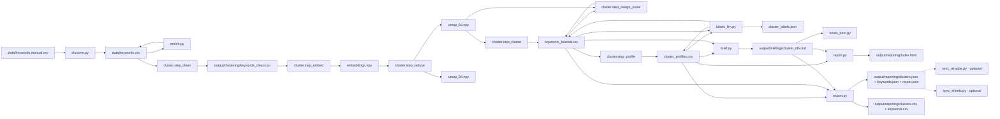

# Developer Guide

Diese Seite richtet sich an alle, die den Code lesen, ändern oder erweitern. Sie erklärt, **wie** der Code organisiert ist, **warum** er so geschnitten ist und welche Entscheidungen Wartbarkeit und Erweiterbarkeit absichern.

Die fachliche Begründung der Methodik (HDBSCAN, UMAP, Hyperparameter) liegt in der [Methodik](methodology.md) bzw. den [Entscheidungen](decisions.md). Diese Seite hier ist die Brücke zwischen Architektur-Diagramm und Quellcode.

!!! tip "Wo schaue ich zuerst rein?"
    1. [`pipeline.py`](https://github.com/t1nak/seo-pipeline/blob/main/pipeline.py) — die End-to-End-Orchestrierung.
    2. [`src/config.py`](https://github.com/t1nak/seo-pipeline/blob/main/src/config.py) — wo alle Schalter wohnen.
    3. Die Module unter `src/` haben jeweils eine Modul-Docstring, die ihren Zweck, ihre Inputs/Outputs und ihre Sub-CLI dokumentiert.

## 1. Repository auf einen Blick

```
seo-pipeline/
├── pipeline.py              # End-to-End-Orchestrator (CLI für die sechs Pipeline-Schritte)
├── src/
│   ├── config.py            # Pydantic Settings, env-getrieben
│   ├── logging_config.py    # einmalige Root-Logger-Konfiguration
│   ├── retry.py             # Decorator: exponential backoff für Provider-Calls
│   ├── discover.py          # Schritt 1: Keyword-Quelle (manual | live)
│   ├── enrich.py            # Schritt 2: SV/KD/CPC anreichern (estimate | dataforseo)
│   ├── cluster.py           # Schritt 3: embed → UMAP → HDBSCAN → assign_noise (Soft) → label-Stub → profile
│   ├── cluster_viz.py       # Plotly-Klick-Map (vom Report-Schritt aufgerufen)
│   ├── labels_llm.py        # Schritt 3b: DE/EN-Labels per Anthropic-Batch-Call
│   ├── subcluster.py        # zweiter HDBSCAN-Pass auf einen Cluster
│   ├── brief.py             # Schritt 4: LLM-Briefs (api | openai | max)
│   ├── briefs_html.py       # konsolidiertes Brief-Dashboard
│   ├── report.py            # Schritt 5: Charts, Cluster-Map, KPI-Dashboard
│   ├── export.py            # Schritt 6: JSON + CSV pro Cluster und pro Keyword
│   ├── sync_airtable.py     # optionaler Airtable-Push (CLI: python -m src.sync_airtable)
│   └── sync_sheets.py       # optionaler Google-Sheets-Push (CLI + Workflow-Step 7)
├── tests/                   # pytest, ohne Netz, ohne API-Keys
├── data/                    # Eingabe-CSVs (gitignored ausser baseline) + cluster_labels.yaml (Fallback)
├── output/                  # alle erzeugten Artefakte (CSV, PNG, HTML, MD, JSON)
└── docs/                    # diese MkDocs-Site
```

`labels_llm.py` läuft heute nicht über `pipeline.py`, sondern wird vom Workflow `pipeline-full.yml` als „Step 3b" zwischen Cluster und Brief explizit aufgerufen. Lokal: `python -m src.labels_llm` (braucht `ANTHROPIC_API_KEY`). Wenn der Schritt fehlt, fällt `cluster.py` beim nächsten Lesen auf `data/cluster_labels.yaml` zurück (siehe [ADR-5](decisions.md#adr-5-llm-generierte-cluster-labels-pro-lauf-yaml-als-fallback)).

Drei Designprinzipien tragen die Struktur:

| Prinzip | Wo sichtbar | Was es bewirkt |
|---|---|---|
| **Ein Modul pro Pipeline-Schritt** | `src/discover.py`, `enrich.py`, `cluster.py`, `brief.py`, `report.py` | Jedes Modul ist isoliert testbar, hat eine eigene `python -m src.<schritt>` Sub-CLI und kann unabhängig redeployed werden. |
| **Artefakte über das Dateisystem** | `data/keywords.csv`, `output/clustering/*.npy`, `output/clustering/*.csv` | Schritte kommunizieren über CSV/NPY auf der Platte, nicht über In-Memory-Objekte. Erlaubt Re-Run einzelner Schritte und macht den Zustand inspizierbar. |
| **Provider sind austauschbar** | `brief.BriefProvider` Subklassen, `enrich.run(provider=...)`, `discover.discover_manual` vs `discover_live` | Externe Abhängigkeiten (Anthropic, OpenAI, DataForSEO, Claude Max) sind hinter einem Interface gekapselt. Wechsel über CLI-Flag oder Env-Var, kein Codepatch. |

## 2. Datenfluss zwischen den Schritten

Jeder Schritt liest klar definierte Dateien und schreibt klar definierte Dateien. Die Pfad-Konstanten stehen am Anfang jedes Moduls (`F_CLEAN`, `F_EMB`, `F_LABELED` etc. in `cluster.py`), damit Code und Doku eine einzige Quelle teilen.



Was diese Grenze leistet:

- **Wiederholbarkeit:** Ein Schritt re-runnen heisst, seine Eingabedateien existieren noch. Kein implizites Setup.
- **Diagnose:** Bei Problemen reicht ein `head` auf das Zwischenartefakt, um zu wissen, ob der Fehler vor oder nach diesem Schritt liegt.
- **Parallelisierbarkeit:** Charts und Cluster-Map laufen heute sequenziell im Report-Schritt, könnten aber auf der gleichen Datenbasis parallel laufen, ohne dass Code geändert werden müsste.

## 3. Konfigurations-Modell

Alle Schalter wohnen in einer Datei: `src/config.py`. Das ist der **Twelve-Factor App** Stil — Konfiguration steht im Environment, nicht im Code.

### Präzedenz, höchste zuerst

1. **CLI-Flag** (`--brief-provider openai` in `pipeline.py`)
2. **Echte Environment-Variable** (`PIPELINE_BRIEF_PROVIDER=openai`)
3. **`.env` Datei** im Repo-Root (lokal, nicht versioniert)
4. **Defaults** in der `Settings` Klasse selbst

### Beispiel: Cluster-Hyperparameter überschreiben

```bash
# Per Lauf, ohne Code-Änderung
export PIPELINE_CLUSTER_HDBSCAN_MCS=10
export PIPELINE_CLUSTER_HDBSCAN_METHOD=leaf
python pipeline.py --step cluster
```

### Was bewusst **nicht** in `Settings` lebt

API-Keys (`ANTHROPIC_API_KEY`, `OPENAI_API_KEY`, `DATAFORSEO_LOGIN`/`_PASSWORD`, `STATICRYPT_PASSWORD`) bleiben rohe Environment-Variablen. Sie tauchen nie in einem typisierten Settings-Dump auf, was versehentliche Logs, Repr-Strings und Fehler-Traces sauber hält.

### Wartbarkeit

| Wenn du ... | dann ... |
|---|---|
| einen neuen Schalter brauchst | Feld in `Settings` ergänzen, Typannotation und Default setzen — Pydantic validiert beim Start. |
| weisst, dass ein Default nur in CI anders sein soll | als Env-Var im Workflow setzen, Default unverändert lassen. Niemand patcht Code dafür. |
| eine Setting umbenennst | grep auf `settings.<altername>` plus Übergang dokumentieren in `decisions.md`. |

## 4. Logging und Beobachtbarkeit

`src/logging_config.py` ist die **einzige** Stelle, an der der Root-Logger angefasst wird. Alle Module folgen dem gleichen Muster:

```python
import logging
logger = logging.getLogger(__name__)
logger.info("doing work")
```

Das hat drei Konsequenzen:

1. **Strukturiertes, kompaktes Format** überall: `2026-04-29 12:34:56 | cluster.embed | INFO | encoding 500 keywords`. Der `_ShortNameFilter` schneidet das `src.` Präfix ab, damit die Spalten ausgerichtet bleiben.
2. **Bibliotheks-Lärm gedämpft**: `urllib3`, `httpx`, `anthropic`, `sentence_transformers` sind hartcodiert auf `WARNING`, sonst würden sie in INFO-Modus den eigenen Pipeline-Output begraben.
3. **Verbosität pro Lauf**: `--log-level DEBUG` in `pipeline.py` oder `PIPELINE_LOG_LEVEL=DEBUG` setzt die Stufe ohne Code-Änderung.

`setup_logging()` ist idempotent (`_CONFIGURED` Flag). Mehrfaches Aufrufen schadet nichts, was Tests und Notebook-Imports unkritisch macht.

## 5. Provider-Abstraktion (Brief-Schritt)

Der LLM-Aufruf ist die Stelle, an der sich Anbieter, Preise, Kontextfenster und Auth-Modelle am häufigsten ändern. Daher ist genau dieser Punkt mit einem schmalen Interface geschützt:

```python
class BriefProvider:
    name: str = "abstract"
    def generate(self, system: str, user: str) -> str: ...
```

Drei konkrete Implementierungen:

| Subklasse | Auth | CI-tauglich | Modellwahl | Caching |
|---|---|---|---|---|
| `ApiKeyProvider` | `ANTHROPIC_API_KEY` | ja | `--model claude-…` | Anthropic ephemeral cache |
| `OpenAIProvider` | `OPENAI_API_KEY` | ja | `--model gpt-…` | automatisch ab 1024 tok prefix |
| `AgentSdkProvider` | lokale Claude-Code-Session | nein, nur lokal | aus Session geerbt | nicht exponiert |

`make_provider(name, model)` ist die einzige Factory-Funktion. Wer einen vierten Provider hinzufügt (z.B. Mistral, lokales Llama), schreibt eine neue Subklasse und einen Eintrag in dieser Factory — sonst ändert sich nichts.

### Robustheit am Provider-Rand

Drei Schutzschichten gegen die Realität externer APIs:

1. **`with_retry` Decorator** auf `generate()` — exponentielles Backoff mit Jitter, honoriert `Retry-After` Header. Definiert in `src/retry.py` (rein Stdlib, ~70 Zeilen, kein externer Kram).
2. **Klassenname-Matching für transiente Fehler** — `retryable_default` matcht auf Substrings wie `"RateLimitError"`, `"OverloadedError"`, `"APITimeoutError"` ohne die SDKs zu importieren. Heisst: das Retry-Modul kennt den Anthropic SDK nicht, kann aber trotzdem dessen Fehlerklassen behandeln.
3. **`_strip_preamble` und `_looks_like_real_brief`** — defensive Helfer, die LLM-Antworten normalisieren (Vorrede entfernen) und beim Dry-Run nie einen echten Brief mit einem Stub überschreiben.

### Wartbarkeit

| Wenn du ... | dann ... |
|---|---|
| einen neuen LLM-Anbieter ergänzt | `BriefProvider` subklassen, in `make_provider` registrieren, optional `@with_retry` benutzen. CLI bleibt unverändert. |
| das System-Prompt änderst | nur `SYSTEM_PROMPT` in `brief.py` editieren. Prompt Caching profitiert davon, dass dieser Block stabil bleibt — Änderungen also bewusst sparsam. |
| die Retry-Policy in CI strenger willst | `PIPELINE_BRIEF_RETRY_MAX_ATTEMPTS=3` im Workflow. Kein Codepatch. |

## 6. Test-Strategie

`tests/` ist klein, aber gezielt. Vier Charakteristiken:

1. **Kein Netz, keine API-Keys.** Alles, was über das offene Internet geht, ist im Test über Fixtures abgeschnitten. CI darf nicht an einem Anthropic-Outage scheitern.
2. **Helfer-zentriert.** `test_brief_helpers.py` testet `_strip_preamble`, `_looks_like_real_brief` etc. — kleine, reine Funktionen, die schnell brechen wenn sich Annahmen über LLM-Output ändern.
3. **Settings-Singleton wird zwischen Tests resettet** (`conftest.py:reset_settings_singleton`). Sonst leaken `PIPELINE_*` Env-Vars zwischen Tests und das Verhalten wird nicht-deterministisch.
4. **Smoke-Test** (`test_smoke.py`) importiert alle Pipeline-Module ohne sie auszuführen. Fängt Import-Zeit-Fehler (fehlende Abhängigkeiten, Syntaxbruch) sofort.

Was bewusst **nicht** getestet wird: das Clustering-Ergebnis selbst. UMAP hat plattformbedingten Drift (gleicher `random_state`, andere CPU = andere Embeddings); ein Snapshot-Test würde in CI dauerhaft rot blinken. Stattdessen prüft die Methodik-Dokumentation die Plausibilität über Silhouette-Score und ARI-Vergleich.

## 7. GitHub Actions Workflows (CI/CD im Detail)

Im Repo liegen zwei YAML-Workflows unter `.github/workflows/`. Sie sind so geschnitten, dass jeder einen klaren Zweck, einen klaren Trigger und einen klaren Kostenrahmen hat. Diese Trennung ist absichtlich — sie macht es schwer, versehentlich einen teuren Lauf auszulösen.

| Datei | Zweck | Trigger | Kosten / Lauf | Secrets nötig |
|---|---|---|---|---|
| `pipeline-full.yml` | Voller Pipeline-Lauf mit Labels und Briefs | nur manuell (`workflow_dispatch`) | ~0,20 – 1 USD | `ANTHROPIC_API_KEY` oder `OPENAI_API_KEY`, optional `DATAFORSEO_*` |
| `docs.yml` | Baut MkDocs, verschlüsselt, deployt nach Pages | `push` auf `main` + manuell | 0 EUR | `STATICRYPT_PASSWORD` |

### 7.1 `pipeline-full.yml` — der einzige Pipeline-Workflow

**Kein Push-Trigger**, nur `workflow_dispatch` (Zeile 11–54). Im Header-Kommentar dokumentiert:

```yaml
# Warum kein push-Trigger: Brief-Step kostet Geld, jeder Lauf soll eine
# bewusste Entscheidung sein. dry_run=true testet die Verkabelung ohne API-Aufruf.
```

**`dry_run` Eingabe** (Zeile 14–17):

```yaml
dry_run:
  description: "Test-Modus: kein LLM-Call, Stubs schreiben (kostenlos, gut für Verkabelungs-Test)"
  type: boolean
  default: false
```

Erlaubt einen kostenlosen Smoke-Test der ganzen Verkabelung, inklusive Brief-Schritt — der Code in `brief.run` schreibt dann Stub-Markdown statt echte Briefs. Default ist `false` (echter Lauf), aber der Bedienende kann gefahrlos die Pipeline-Mechanik durchprüfen.

**Provider-Auswahl mit CI-bewusster Filterung** (Zeile 18–24):

```yaml
brief_provider:
  description: "... max (Agent SDK) ist lokal-only und in CI nicht verfügbar."
  type: choice
  options:
    - api
    - openai
  default: api
```

Der dritte Provider (`max`, Claude Code Subscription) **fehlt absichtlich** in dieser Liste. Er braucht eine angemeldete lokale CLI-Session, die GitHub-Runner nicht haben. Statt das im Code zu prüfen und mit Fehler abzubrechen, ist die UI-Auswahl direkt gefiltert — ein „nicht nutzbar" Pfad wird gar nicht erst angeboten. Dokumentiert in der Description.

**Pre-Flight-Check des Provider-Secrets** (Zeile 80–101):

```yaml
- name: Verify provider secret
  if: ${{ !inputs.dry_run }}
  env:
    ANTHROPIC_API_KEY: ${{ secrets.ANTHROPIC_API_KEY }}
    OPENAI_API_KEY: ${{ secrets.OPENAI_API_KEY }}
    BRIEF_PROVIDER: ${{ inputs.brief_provider }}
  run: |
    if [ "$BRIEF_PROVIDER" = "api" ]; then
      if [ -z "$ANTHROPIC_API_KEY" ]; then
        echo "::error::ANTHROPIC_API_KEY secret missing for --brief-provider api."
        exit 1
      fi
      echo "ANTHROPIC_API_KEY present (length: ${#ANTHROPIC_API_KEY})"
    elif [ "$BRIEF_PROVIDER" = "openai" ]; then
      ...
    fi
```

Vier wichtige Eigenschaften:

1. **`if: ${{ !inputs.dry_run }}`** — der Check wird bei `dry_run=true` übersprungen, weil dann gar kein Secret nötig ist.
2. **Frühes Scheitern** — wenn das Secret fehlt, bricht der Workflow hier ab statt drei Schritte später, mitten in `pip install`. `::error::` ist die GitHub-Annotation, die im UI rot hervorgehoben wird.
3. **Konkrete Handlungsanweisung** — die Fehlermeldung sagt, wo man das Secret eintragen muss („Settings -> Secrets and variables -> Actions").
4. **Keine Logleck** — `echo` druckt nur die **Länge** des Keys (`${#ANTHROPIC_API_KEY}`), niemals den Wert. Ein versehentliches `echo $ANTHROPIC_API_KEY` würde GitHub zwar auto-maskieren (Secret Masking), aber sich auf das Masking zu verlassen wäre fragil.

**Conditional CLI-Flag in Bash** (Zeile 125–126):

```yaml
run: |
  python pipeline.py ${{ inputs.dry_run && '--dry-run' || '' }}
```

Ternary-Ausdruck der GitHub-Expression-Sprache: bei `dry_run=true` wird `--dry-run` ans Kommando angehängt, sonst nichts. So bleibt `pipeline.py` ohne Sonderlogik für den CI-Modus.

**Step 6 (Export) und Step 7 (Sheets-Sync):**

```yaml
- name: Step 6 -- Export reporting (JSON + CSV für Airtable, Notion, Sheets)
  run: python pipeline.py --step export

- name: Step 7 -- Sync reporting to Google Sheets
  if: ${{ inputs.sheets_sync }}
  env:
    PIPELINE_SHEETS_SYNC_ENABLED: "true"
    PIPELINE_SHEETS_ID: ${{ vars.GOOGLE_SHEETS_ID }}
    GOOGLE_SHEETS_CREDENTIALS_JSON: ${{ secrets.GOOGLE_SHEETS_CREDENTIALS_JSON }}
  run: |
    if [ -z "$GOOGLE_SHEETS_CREDENTIALS_JSON" ]; then
      echo "::error::sheets_sync=true requires GOOGLE_SHEETS_CREDENTIALS_JSON secret."
      exit 1
    fi
    python -m src.sync_sheets
```

Step 6 läuft immer und schreibt fünf flache Dateien (`clusters.json/.csv`, `keywords.json/.csv`, `report.json`) für externes Reporting. Step 7 ist optional und gated:

- **`if: ${{ inputs.sheets_sync }}`** überspringt den Step komplett wenn der Toggle nicht an ist. Ergibt einen sauberen „Skipped"-Status im UI statt einer harten Annahme über fehlende Secrets.
- **`PIPELINE_SHEETS_SYNC_ENABLED: "true"`** überschreibt den Default-Schalter in `Settings`, damit `src.sync_sheets` tatsächlich pusht statt no-op.
- **Pre-Flight-Check** für das Secret und die Variable, gleiches Muster wie der `Verify provider secret`-Step weiter oben. Konkrete Fehlermeldung mit Link auf die Setup-Doku.

Setup-Anleitung für Service Account, Secret und Variable: [`reporting-integration.md`](reporting-integration.md#variante-c-direkter-push-aus-der-pipeline-privat-automatisch).

### 7.2 `docs.yml` — Build, Encrypt, Deploy

Baut die MkDocs-Site, verschlüsselt sie mit StatiCrypt und deployt sie auf GitHub Pages.

**Trigger** (Zeile 3–6):

```yaml
on:
  push:
    branches: [main]
  workflow_dispatch:
```

Kein Path-Filter — Doku-Änderungen sind für sich der Auslöser. Auch jeder Code-Push auf main triggert ihn (was harmlos ist, weil das Bauen schnell ist und nur die Doku-Site neu deployt).

**Erweiterte Permissions** (Zeile 8–11):

```yaml
permissions:
  contents: read
  pages: write
  id-token: write
```

Drei spezifische Rechte:

- `contents: read` — Code lesen (Standard).
- `pages: write` — auf den GitHub-Pages-Endpoint deployen.
- `id-token: write` — OIDC-Token für die `actions/deploy-pages@v4` Action. Diese verwendet kein langlebiges Secret, sondern OpenID Connect, ein temporäres Token pro Lauf. Sicherer als ein PAT zu hinterlegen.

**Concurrency** (Zeile 13–15):

```yaml
concurrency:
  group: pages
  cancel-in-progress: false
```

Verhindert race conditions, wenn zwei Doku-Pushes hintereinander kommen — der zweite wartet, statt einen halb-deployten Stand zu produzieren.

**Build-Schritte** im Überblick:

| Schritt | Was er tut |
|---|---|
| Checkout + Setup Python | Standard, mit Pip-Cache |
| Install MkDocs | aus `requirements-docs.txt` (separate von `requirements.txt`, damit der Doku-Build keine ML-Abhängigkeiten braucht) |
| `mkdocs build --strict` | bricht bei toten Links und MkDocs-Warnings ab |
| Copy live artifacts | kopiert `output/` ins gebaute `site/` (siehe unten) |
| Setup Node + Install StatiCrypt | wegen NPM-Tooling |
| Encrypt site | StatiCrypt-Loop über alle HTML-Dateien |
| Upload artifact + Deploy | Standard Pages-Pipeline |

**Live-Artefakte einbinden** (Zeile 35–43):

```yaml
- name: Copy live artifacts into site
  # Preserve the existing URLs:
  #   /seo-pipeline/output/clustering/cluster_map.html
  #   /seo-pipeline/output/reporting/index.html
  # MkDocs serves docs/ only; copying output/ alongside the built site
  # keeps the live cluster map and report dashboard reachable.
  run: |
    cp -r output site/output
    cp .nojekyll site/.nojekyll
```

Wichtige Maintainability-Eigenschaft: die Pages-URL-Struktur ist explizit dokumentiert im Workflow-Kommentar. Wer in `mkdocs.yml` einen Link auf `/output/...` sieht und sich fragt „wie kommt das in den Build?", findet hier die Antwort.

`.nojekyll` ist nötig, damit GitHub Pages den Inhalt 1:1 ausliefert statt eine Jekyll-Verarbeitung zu triggern (die z.B. Dateien mit `_` Präfix verstecken würde).

**Encryption-Schritt im Detail** (Zeile 53–79):

```yaml
- name: Encrypt site with shared password
  env:
    STATICRYPT_PASSWORD: ${{ secrets.STATICRYPT_PASSWORD }}
  run: |
    # 1. Drop the search index (would leak content as plain JSON)
    rm -rf site/search

    # 2. Encrypt every HTML file in place. Loop because staticrypt's
    #    -r flag nests output under the input dir name, which would
    #    break Pages routing. One file at a time keeps paths flat.
    find site -type f -name '*.html' | while read -r f; do
      staticrypt "$f" \
        --short \
        --template-button "Show case study" \
        --template-instructions "Enter the access password ..." \
        --template-color-primary "#0f172a" \
        --template-color-secondary "#2dd4bf" \
        --directory "$(dirname "$f")"
    done

    # 3. Verify: a sampled file should now contain the StatiCrypt loader
    grep -q "staticrypt" site/index.html && echo "encryption OK"
```

Drei Aspekte, die hier subtil aber wichtig sind:

1. **Suchindex-Leak schliessen** (`rm -rf site/search`) — MkDocs Material legt einen JSON-Suchindex an, der den Volltext aller Seiten enthält. Den HTML-Wrapper kann StatiCrypt verschlüsseln, aber das JSON wäre weiterhin Klartext per HTTP zugänglich. Das Löschen des Suchindex ist die kostengünstigste Lösung — die Such-Funktion auf der Site ist damit weg, dafür ist die Inhalts-Sperre wirklich dicht. Ein expliziter Kommentar im Workflow erklärt das, damit niemand die Such-Funktion „repariert", ohne den Trade-off zu sehen.
2. **Per-File-Loop** statt rekursivem Encrypt — StatiCrypts `-r` Flag würde die Output-Pfade verschachteln und Pages-Routing brechen. Der Loop hält die Pfade flach.
3. **Verify-Schritt** am Ende — `grep` prüft, ob mindestens `index.html` den StatiCrypt-Loader enthält. Wenn der Encrypt-Schritt still gescheitert ist (z.B. wegen leerem Passwort), bricht der grep ab und der Workflow rot wird.

**Zwei-Job-Trennung** (Zeile 86–95):

```yaml
deploy:
  needs: build
  runs-on: ubuntu-latest
  environment:
    name: github-pages
    url: ${{ steps.deployment.outputs.page_url }}
  steps:
    - uses: actions/deploy-pages@v4
```

Der `deploy`-Job hängt vom `build`-Job ab (`needs: build`). Trennung in zwei Jobs hat zwei Vorteile:

- **Separate Permissions** möglich (Build braucht andere Rechte als Deploy, hier sind sie zwar global, könnten aber pro Job spezialisiert werden).
- **GitHub-Pages-Environment** wird sichtbar in der Repo-UI mit dem Deploy-Status und einer Verknüpfung zur veröffentlichten URL.

### 7.3 Wartbarkeits-Checkliste für die Workflows

| Wenn du ... | dann ... |
|---|---|
| ein neues `PIPELINE_*` Setting in `config.py` ergänzt | überlege, ob es als `workflow_dispatch.input` exponiert werden soll. Falls ja: in beiden Pipeline-Workflows ergänzen, gleicher Name, gleicher Typ. |
| ein Embedding-Modell wechselst | den Cache-Key in beiden Pipeline-Workflows aktualisieren (`st-${{ runner.os }}-...`) — sonst läuft mit altem Cache und neuen Code-Erwartungen. |
| einen neuen Secret-Wert brauchst | Secret in den Repo-Settings anlegen, in der `env:` Block des betreffenden Steps mappen, und einen Pre-Flight-Check wie in `pipeline-full.yml` ergänzen, damit das Fehlen früh und klar abbricht. |
| eine Doku-Seite umbenennst und sie war unter `--strict` Pflicht | `mkdocs build --strict` würde brechen — daher heisst Umbenennen: alle Verweise prüfen und ggf. Redirects in `mkdocs.yml` setzen. Der Workflow ist hier dein Sicherheitsnetz. |
| die Cron-Ausführung aktivierst | `pipeline-full.yml` bewusst **nicht** automatisieren, sonst setzt sich der Kostenrahmen leise höher. Falls doch gewünscht: `dry_run=true` als Default und ein Hard-Cap auf `cluster_mcs`/`max_keywords` setzen. |

### 7.4 Häufige Stolpersteine

- **„Mein Lauf hat falsche Settings genommen"** — der `push`-Trigger hat keine `inputs`, also greifen Pydantic-Defaults. Manuell mit `workflow_dispatch` triggern, wenn andere Werte gewünscht sind.
- **„Der Modell-Cache cached etwas Falsches"** — Cache-Key per Hand bumpen (z.B. `key: st-${{ runner.os }}-...-v2`). GitHub-Caches selber lassen sich aus der Actions-UI löschen, aber Key-Bump ist sicherer.
- **„Pages zeigt leere Seite"** — meist `mkdocs build --strict` durchgewunken, aber StatiCrypt mit leerem Passwort scheiterte. Der Verify-`grep` am Ende von `docs.yml` fängt das.
- **„DataForSEO-Lauf in CI bricht ab"** — Quota erreicht, oder Secret fehlt für `--provider dataforseo`. Wechsel auf `estimate` als sofortige Workaround, dann Quota prüfen.

## 8. Designentscheidungen, die direkt im Code wirken

Eine kompakte Sammlung der Wahlmöglichkeiten, die im Code konkret zu sehen sind. Die Volltext-Begründung steht in den [Architektur-Entscheidungen (ADRs)](decisions.md).

### Stdlib-Retry statt `tenacity`

Rationale: Total ~70 Zeilen, kein extra Dependency, lesbar in einem Code-Review, frei von Klassenzustand. Der einzige Nachteil — fehlende Plugins — ist hier keiner, weil das Featureset (exp. backoff, jitter, Retry-After) trivial ist. Siehe `src/retry.py`.

### CSV statt SQLite oder Parquet als Pipeline-Bus

Rationale: Inspizierbar mit `head`, diff-bar in Git, keine Schema-Migration, von Pandas in einer Zeile gelesen. Bei einer Skalierung über mehrere Millionen Keywords wäre Parquet sinnvoller — dieser Punkt ist in `decisions.md` markiert.

### Multilinguales MiniLM statt englisches L6 oder grosses BGE-M3

Rationale: zvoove-Keywords sind deutsch, deutsche Morphologie wäre in einem englischen Modell schlecht abgebildet. BGE-M3 wäre besser, aber 2 GB statt 120 MB und braucht GPU für brauchbare Geschwindigkeit. MiniLM-L12 läuft auf einem MacBook in 25 Sekunden auf 500 Keywords. Dokumentiert im Docstring von `cluster.step_embed`.

### HDBSCAN-Defaults aus dem Sweep

Rationale: Der Hyperparameter-Sweep zeigt eine Plateau-Region. Aktueller Default in der Workflow-UI: `mcs=10, ms=5, eom` (13 Cluster, 72 Noise, 14 Prozent Rauschen, Silhouette 0,647 auf den Kern-Keywords). Die Wahl ist Trade-off-getrieben: `mcs=15/leaf` hatte zwar gleiche Cluster-Anzahl, aber 130 Noise (26 Prozent), `mcs=12/eom` nur 40 Noise aber einen Sammelcluster mit 188 Keywords. `mcs=10/eom` ist der beste Kompromiss aus Granularität und Rauschrate. Die verbleibenden 72 Noise-Keywords werden vom `assign_noise` Schritt soft-assigned (siehe [ADR-15](decisions.md#adr-15-soft-assignment-fur-noise-keywords)). Konstanten in `Settings` (`cluster_hdbscan_mcs`, `cluster_hdbscan_method`, `cluster_hdbscan_ms`), Begründung in der [Methodik](methodology.md).

### LLM-generierte Cluster-Labels mit YAML-Fallback

`src/labels_llm.py` ruft Anthropic Haiku einmal pro Lauf mit allen Clustern auf und schreibt `output/clustering/cluster_labels.json`. `src/cluster.py` lädt diese JSON beim Start (über `_load_cluster_labels`); fehlt sie, fällt es auf `data/cluster_labels.yaml` zurück. Cluster-IDs ohne Label landen auf `Cluster N`, das verhindert KeyError bei beliebigen Hyperparameter-Kombinationen. Wartung: Bei Daten-Refresh den Schritt re-running, oder die JSON manuell pinnen wenn Labels für eine Veröffentlichung stabil bleiben sollen. Der zugehörige ADR ist [ADR-5](decisions.md#adr-5-llm-generierte-cluster-labels-pro-lauf-yaml-als-fallback).

### Klassennamen-Matching für transiente Fehler

`retry._TRANSIENT_CLASS_PATTERNS` matcht Substrings wie `"RateLimitError"`. Damit hängt das Retry-Modul **nicht** vom Anthropic- oder OpenAI-SDK ab. Konsequenz: Diese SDKs bleiben aus dem Test-Pfad raus, das Retry-Modul ist unabhängig getestet, und man kann jeden zukünftigen Provider hinzufügen ohne Retry-Code anzufassen.

## 9. Lokale Entwicklung

### Schneller Setup

```bash
python -m venv .venv && source .venv/bin/activate
pip install -r requirements.txt
pip install -r requirements-dev.txt
cp .env.example .env       # API-Keys eintragen
pytest -q                  # ~3 s, kein Netz nötig
```

### Iterativ an einem einzelnen Schritt arbeiten

Jeder Schritt hat eine eigene Sub-CLI:

```bash
python -m src.discover --source manual --max-keywords 200
python -m src.enrich --provider estimate
python -m src.cluster --step embed,reduce,cluster,assign_noise,label,profile
python -m src.labels_llm                            # DE/EN Labels per Anthropic Haiku
python -m src.brief --provider api --cluster 5 --model claude-sonnet-4-6
python -m src.briefs_html
python -m src.report
```

### Brief-Schritt ohne API-Kosten testen

```bash
python -m src.brief --dry-run         # Stubs statt echter Briefs
```

### Cluster-Hyperparameter tunen

```bash
python -m src.cluster --step sweep    # gibt die Sweep-Tabelle aus
PIPELINE_CLUSTER_HDBSCAN_MCS=10 python -m src.cluster --step cluster,label
```

## 10. Erweiterungs-Rezepte

### Neuen Pipeline-Schritt hinzufügen

1. Neue Datei `src/<schritt>.py` mit Modul-Docstring (Zweck, Eingaben, Ausgaben, CLI-Beispiele).
2. Eine Top-Level-`run(...)` Funktion, eine `main()` Funktion, ein `if __name__ == "__main__"` Block.
3. In `pipeline.py` ein `step_<schritt>(args)` plus Eintrag in `RUNNERS` und `ALL_STEPS`.
4. Falls neue Settings gebraucht: in `src/config.py` ergänzen.
5. Smoke-Test aufnehmen (`tests/test_smoke.py`).

### Neuen Provider für einen bestehenden Schritt hinzufügen

Beispiel Brief-Schritt:

1. `class MyProvider(BriefProvider)` in `brief.py` mit `name`, `__init__` (Auth-Check) und `generate`.
2. Eintrag in `make_provider`.
3. Optional `@with_retry()` auf `generate` setzen, wenn der Anbieter transiente Fehler wirft, deren Klassenname die `_TRANSIENT_CLASS_PATTERNS` trifft (sonst eigenes Pattern ergänzen).
4. CLI-Choices in `argparse` aktualisieren und den Settings-Literal-Typ erweitern.

### Cluster-Labels nach einem Daten-Refresh aktualisieren

1. `python -m src.cluster --step all` laufen lassen.
2. `python -m src.labels_llm` aufrufen (Anthropic API Key gesetzt). Schreibt `output/clustering/cluster_labels.json` und aktualisiert die Label-Spalten in `cluster_profiles.csv` und `keywords_labeled.csv`.
3. Optional: für höhere Qualität `--model claude-sonnet-4-6` setzen.
4. Wenn Labels für eine Veröffentlichung stabil bleiben sollen: die generierte JSON pinnen oder per Hand in `data/cluster_labels.yaml` übertragen, dann die JSON löschen — `cluster.py` fällt automatisch auf YAML zurück.
5. Anschließend `python -m src.report` für die Dashboards und Charts.

## 11. Was diese Architektur explizit **nicht** löst

Ehrlich, damit niemand falsche Annahmen mitnimmt:

- **Keine Streaming-Pipeline.** Alles ist Batch. Bei häufigen kleinen Updates (z.B. neuer Blogpost stündlich) müsste man auf eine Event-Queue umschwenken.
- **Keine Multi-Tenant-Trennung.** Pfade sind hartcodiert auf `data/`, `output/`. Mehrere Mandanten pro Repo wären eine Refactor-Aufgabe.
- **Kein Schema-Versioning.** CSVs haben keine eingebettete Versionsnummer. Eine inkompatible Spaltenänderung würde alte `output/`-Snapshots brechen. Heute akzeptabel weil Snapshots in Git versioniert sind.
- **Keine echte Authn/Authz für die Pages-Site.** StatiCrypt mit Shared Password schützt vor zufälligem Zugriff, ist aber kein Ersatz für SSO.

Diese Lücken sind bewusst gewählt — sie sind in `decisions.md` mit Trade-off und Schwellenwert dokumentiert, ab dem sie geschlossen werden müssten.

---

[Zurück zur Übersicht :octicons-arrow-right-24:](index.md){ .md-button }
[Architektur-Entscheidungen (ADRs) :octicons-arrow-right-24:](decisions.md){ .md-button }
