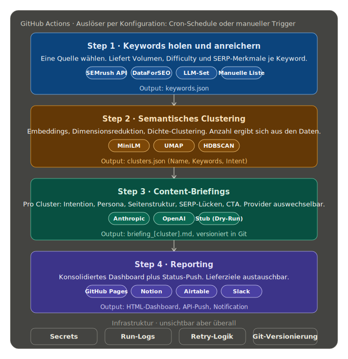

# SEO Keyword Pipeline für zvoove

## Was ist die SEO Pipeline?

Eine Daten-Pipeline für die automatisierte Erstellung von SEO Content Briefs. Vier modulare Phasen mit auswechselbaren Providern an jeder Stelle: Keyword-Quelle, LLM für Briefings, Reporting-Ziel. Die Architektur unten zeigt die wählbaren Komponenten je Phase, der Auslöser läuft per Cron-Schedule oder manuellem Trigger.



**Beispiel-Demo:** Im Beispiel ist der Entry Point eine Liste von 500 LLM-erzeugten Keywords. In einer produktiven Pipeline kann dieser Entry Point genauso von externen Anbietern wie Semrush, Ahrefs oder DataForSEO kommen, die Phase ist über die Konfiguration austauschbar. Aus den Keywords entstehen thematische Cluster, Content Briefs und ein interaktives Reporting. Lokale ML, Anthropic API für Briefs, GitHub Pages für die Live-Demo. Der Discover-Schritt scrapt den Blog noch nicht live, das ist transparent in den [Entscheidungen](decisions.md) dokumentiert und der nächste Arbeitsblock.

[:material-rocket-launch: Go to Pipeline (GitHub Actions)](https://github.com/t1nak/seo-pipeline/actions/workflows/pipeline-full.yml){ .md-button .md-button--primary target=_blank rel=noopener }

## Grundlagen

- [Wie wird die Pipeline getriggert?](#wie-wird-die-pipeline-getriggert)
- [Wie kann ich Model und Provider ändern?](#wie-kann-ich-model-und-provider-andern)
- [Was kostet ein Lauf?](#was-kostet-ein-lauf)
- [Wie viele Cluster werden erkannt?](#wie-viele-cluster-werden-erkannt)
- [Was ist lokal, und was wäre in einer produktiven Pipeline anders?](#was-ist-lokal-und-was-ware-in-einer-produktiven-pipeline-anders)
- [Welche Parameter beeinflussen das Ergebnis maßgeblich?](#welche-parameter-beeinflussen-das-ergebnis-massgeblich)
- [Welche Variablen sind sicherheitskritisch?](#welche-variablen-sind-sicherheitskritisch-wegen-api-kosten-und-berechtigungen)

### Wie wird die Pipeline getriggert?

GitHub Actions: per Cron-Schedule oder manuellem Trigger via [`workflow_dispatch`](https://github.com/t1nak/seo-pipeline/actions/workflows/pipeline-full.yml). Lokal startest du sie mit `python pipeline.py`, einzelne Schritte via `--step cluster|brief|report`.

### Wie kann ich Model und Provider ändern?

Der einfachste Weg ist die GitHub Actions UI: beim manuellen Auslösen von [`pipeline-full.yml`](https://github.com/t1nak/seo-pipeline/blob/main/.github/workflows/pipeline-full.yml) erscheinen Dropdowns für Provider und Modell-ID direkt im Browser, kein Code-Edit nötig.

| Eingabefeld | Optionen | Default |
|---|---|---|
| **Brief-Provider** | `api` (Anthropic), `openai` | `api` |
| **Modell-ID** | beliebige ID, z.B. `claude-sonnet-4-6`, `gpt-5` | leer = Provider-Default |
| **Enrich-Provider** | `estimate` (kostenlos), `dataforseo` | `estimate` |

Lokal lassen sich dieselben Einstellungen als `PIPELINE_*` Environment-Variable oder CLI-Flag übergeben. Die vollständige Referenz aller Variablen, die Präzedenz-Reihenfolge und Beispiele für CI und lokale `.env` Dateien stehen im [Developer Guide](developer-guide.md#3-konfigurations-modell).

### Was kostet ein Lauf?

Hängt vom gewählten Modell und Provider ab. Beispielwerte für 13 Cluster, 500 Keywords:

| Konfiguration | Brief | Labels | Enrich | Gesamt |
|---|---|---|---|---|
| Anthropic Sonnet 4.6 (Caching) plus Heuristik | ~0,18 bis 0,25 USD | ~0,01 USD | 0 USD | **~0,20 USD** |
| OpenAI GPT-5 plus Heuristik | ~0,30 bis 0,40 USD | ~0,01 USD | 0 USD | **~0,35 USD** |
| Anthropic Sonnet plus DataForSEO Live | ~0,18 bis 0,25 USD | ~0,01 USD | ~0,75 USD | **~1,00 USD** |
| Claude Subscription (Max/Pro) plus Heuristik | 0 USD (im Abo) | ~0,01 USD | 0 USD | **~0,01 USD** |

Bei wöchentlicher Ausführung mit Anthropic API plus Heuristik also ungefähr 10 USD pro Jahr, mit DataForSEO eher 50 USD. Vollständige Tabelle und Annahmen in §12 der [Case Study](case-study.md) und [Architektur](architecture.md#kosten-pro-lauf-je-provider-kombination).

### Wie viele Cluster werden erkannt?

HDBSCAN bestimmt die Cluster-Anzahl selbst aus der Datendichte, ohne vorgegebene `k`. Mit dem aktuellen Default `mcs=10, ms=5, eom` entstehen aus der 500-Keyword-Baseline **13 Cluster, alle 500 Keywords sind zugeordnet**. HDBSCAN markiert zunächst 72 Rand-Keywords als Noise (14 Prozent), die anschließend per Soft-Assignment ihrem nächsten Cluster-Centroid zugeordnet werden ([ADR-15](decisions.md#adr-15-soft-assignment-fur-noise-keywords)) — Endzustand: 0 Outlier. Die Labels werden pro Lauf von einem Anthropic-Haiku-Aufruf erzeugt ([ADR-5](decisions.md#adr-5-llm-generierte-cluster-labels-pro-lauf-yaml-als-fallback)). Begründung der Wahl `mcs=10/eom` in der [Methodik](methodology.md).

### Was ist lokal, und was wäre in einer produktiven Pipeline anders?

**Aktuell (Case-Study-Setup):** Alles bleibt im Repo, keine externen Datenbanken. Die Artefakte liegen unter:

- `data/keywords.csv` (angereicherte Keyword-Liste)
- `output/clustering/` (Embeddings, UMAP-Reduktionen, Cluster-Map, Diagnostik-Charts)
- `output/briefings/cluster_*.md` (Content-Briefings je Cluster)
- `output/reporting/index.html` (konsolidiertes Dashboard)

API-Keys liegen in `.env` (lokal) bzw. GitHub Secrets (CI), nicht im Repo.

**In einer produktiven Pipeline würde sich typischerweise ändern:**

- **Storage:** Artefakte in Object Storage (z. B. S3) statt im Repo, damit Läufe versioniert und teamweit zugänglich sind.
- **Metadaten und Historie:** Keyword-Tabellen, Cluster-Zuordnungen und Briefing-Stände in einer Datenbank (z. B. Postgres), damit sich Verläufe über Zeit auswerten lassen.
- **Secrets:** Zentrales Secret-Management (Vault, AWS Secrets Manager, GitHub Actions Environments) statt `.env`-Dateien.
- **Beobachtbarkeit:** Strukturierte Logs, Cost-Tracking je Lauf und Alerts statt Konsolen-Output.
- **Trigger:** Geplante Läufe und Event-Trigger (neuer Blog-Post, manuelle Freigabe) statt nur lokalem CLI-Aufruf.

### Welche Parameter beeinflussen das Ergebnis maßgeblich?

Sortiert nach Hebelwirkung auf das Cluster-Ergebnis:

| Parameter | Wirkung | Empfohlen |
|---|---|---|
| **`cluster_hdbscan_mcs`** | Steuert Cluster-Anzahl direkt. Kleiner = mehr (kleinere) Cluster. | 12 (Plateau-Mitte) |
| **`cluster_hdbscan_method`** | `eom` für stabile, größere Cluster · `leaf` für viele kleine Sub-Cluster | `eom` |
| **`cluster_hdbscan_ms`** | Wie streng die Dichte-Definition ist (höher = restriktiver) | 5 |
| **`cluster_umap_neighbors`** | Lokale vs globale Struktur in der Reduktion (UMAP) | 15 |
| **Embedding-Modell** | Semantische Qualität, mehrsprachig vs einsprachig | `paraphrase-multilingual-MiniLM-L12-v2` |
| **`discover_max_keywords`** | Cap auf Eingabe-Größe; beeinflusst Dichte-Verteilung | 500 |

Begründung der Default-Werte und Sensitivitäts-Analyse mit Sweep-Tabelle in der [Methodik](methodology.md#5-hyperparameter-sweep-die-volle-tabelle).

### Welche Variablen sind sicherheitskritisch wegen API-Kosten und Berechtigungen?

| Variable | Sensibilität | Wo gespeichert |
|---|---|---|
| `ANTHROPIC_API_KEY` | API-Kosten (~0,15 USD pro Brief-Lauf, Rate-Limits) | GitHub Secrets (CI) · `.env` (lokal, gitignored) |
| `OPENAI_API_KEY` | API-Kosten (~0,30 USD pro Brief-Lauf) | dito |
| `DATAFORSEO_LOGIN` + `_PASSWORD` | API-Kosten (~0,75 USD pro 500-Keyword Enrichment) | dito |
| `SEMRUSH_API_KEY` (falls Discover-Provider) | API-Kosten + Quota-Limit | dito |

**Schutz-Mechanismen:**

- **`workflow_dispatch`** ist die einzige Trigger-Option für `pipeline-full.yml` — kein versehentliches Auslösen über Push.
- **Secrets sind `null` bei fehlender Konfiguration**; der Workflow bricht früh ab mit `::error::ANTHROPIC_API_KEY secret missing` statt blind zu starten.
- **API-Keys nie in Logs** — der Workflow prüft nur die Länge (`${#ANTHROPIC_API_KEY}`), nicht den Wert.
- **Rate-Limit-Schutz** in `brief.py` über Retry-Wrapper mit Exponential Backoff plus Jitter.

## Schnelle Einstiegspunkte

<div class="grid cards" markdown>

-   :material-rocket-launch: __Pipeline jetzt starten__

    Workflow-Dispatch in GitHub Actions: Provider und Modell wählen, Lauf starten. Status, Logs und Artefakte direkt im Run.

    [:octicons-arrow-right-24: Pipeline ausführen](https://github.com/t1nak/seo-pipeline/actions/workflows/pipeline-full.yml)

-   :material-map-marker-radius: __Interaktive Cluster Karte__

    13 Themengruppen visuell, mit Klick auf jeden Punkt die Details. Sprache umschaltbar.

    [:octicons-arrow-right-24: Live Demo](https://t1nak.github.io/seo-pipeline/output/clustering/cluster_map.html)

-   :material-file-chart: __Reporting Dashboard__

    KPIs, Cluster Tabelle, Charts, Brief Links auf einer Seite.

    [:octicons-arrow-right-24: Live Demo](https://t1nak.github.io/seo-pipeline/output/reporting/index.html)

-   :material-card-text-outline: __Cluster Briefs Dashboard__

    Pro Cluster ein Content Brief mit Top-Keywords, Persona, Seitenstruktur, SERP-Lücken, CTA.

    [:octicons-arrow-right-24: Live Demo](https://t1nak.github.io/seo-pipeline/output/briefings/index.html)

-   :material-book-open-variant: __Case Study__

    Vollständige Schreibarbeit mit Architektur, Validierung, Empfehlungen, Reflektion.

    [:octicons-arrow-right-24: Lesen](case-study.md)

-   :material-flask: __Methodik__

    Warum HDBSCAN, warum UMAP, Hyperparameter Sweep, Validierung mit echten Zahlen.

    [:octicons-arrow-right-24: Tiefe](methodology.md)

-   :material-format-list-bulleted: __Cluster Katalog__

    Pro Cluster: Stats, Top Keywords, Empfehlung, Aufwand, Revenue Hypothese.

    [:octicons-arrow-right-24: Ergebnisse](results.md)

-   :material-file-tree: __Architektur__

    Datenfluss, Schnittstellen, Revenue Stack Integration, Skalierungs-Verhalten.

    [:octicons-arrow-right-24: Diagramm](architecture.md)

</div>

## Ergebnisse aus dem aktuellen Lauf

<div class="grid" markdown>

`500` Keywords (Cap aus 504 Baseline)
{ .annotate }

`13` Cluster, **0 Outlier**

`239.976` SV pro Monat (geschätzt)

`0,65` Silhouette HDBSCAN-Kern

`mcs=10/eom` plus Soft-Assignment

`~30 s` voller Lauf ohne Briefs

</div>

Die fünf größten Cluster nach Suchvolumen:

| # | Cluster | Keywords | SV / Monat | Ø KD | % komm. |
|---|---|---|---|---|---|
| 10 | HR Software Dokumenten- und Mitarbeiterverwaltung | 45 | 45.567 | 52 | 89 |
| 12 | Sammelthemen Zeitarbeit Software und Finanzierung | 97 | 28.301 | 36 | 34 |
| 1 | Zeiterfassung und Zeitarbeitssoftware | 47 | 26.159 | 48 | 94 |
| 7 | Digitalisierung Personaldienstleistung und KI | 37 | 23.984 | 36 | 35 |
| 3 | Zvoove Produkte und Features | 34 | 23.604 | 52 | 97 |

HDBSCAN findet 13 Cluster aus den Daten heraus (`mcs=10, eom`). 72 Rand-Keywords werden per Soft-Assignment ihrem nächsten Cluster-Centroid zugeordnet ([ADR-15](decisions.md#adr-15-soft-assignment-fur-noise-keywords)) — alle 500 Keywords haben einen Pillar. Cluster-Labels werden pro Lauf von einem Anthropic-Haiku-Aufruf erzeugt ([ADR-5](decisions.md#adr-5-llm-generierte-cluster-labels-pro-lauf-yaml-als-fallback)). Zwei Cluster sind vom LLM transparent als „Sammelthemen" markiert und benötigen Sub-Clustering vor redaktioneller Bearbeitung.

[Alle Cluster im Detail :octicons-arrow-right-24:](results.md)

## Aktueller Stand der Pipeline

| Schritt | Stand |
|---|---|
| Discover | Stub. `--source manual` funktioniert, `--source live` ist offen |
| Enrich | Vollständig. Heuristik plus optional DataForSEO Live Lookup |
| Cluster | Vollständig. Embeddings, UMAP, HDBSCAN, Soft-Assignment, Profiling |
| Labels (LLM) | Vollständig. Anthropic Haiku Batch-Call, JSON pro Lauf, YAML-Fallback |
| Brief | Vollständig. Claude API mit Prompt Caching |
| Report | Vollständig. Charts, Cluster-Map, konsolidiertes HTML Dashboard |

## Schnellstart

```bash
# Abhängigkeiten installieren
pip install -r requirements.txt

# Komplette Pipeline ausführen
python pipeline.py

# Einzelne Schritte
python pipeline.py --step cluster
python pipeline.py --step brief --dry-run    # ohne Claude API
python pipeline.py --step report
```

Für echte Content Briefs (sonst Stubs) wird ein Anthropic API Key gebraucht:

```bash
export ANTHROPIC_API_KEY=sk-ant-...
python pipeline.py --step brief
```

[Vollständige CLI Referenz im Repo :octicons-arrow-right-24:](https://github.com/t1nak/seo-pipeline#schnellstart)

## Tech Stack auf einen Blick

| Schicht | Werkzeug | Warum |
|---|---|---|
| Embeddings | `paraphrase-multilingual-MiniLM-L12-v2` | mehrsprachig, läuft lokal ohne GPU |
| Reduktion | `umap-learn` | bessere lokale Struktur als PCA für density-based clustering |
| Clustering | `hdbscan` | wählt Clusteranzahl selbst, markiert Ausreißer als Rauschen |
| Vergleich | Ward Hierarchical (`scipy`) | transparente Granularitäts-Kontrolle, ARI als Gegenprobe |
| Visualisierung | `plotly` (interaktiv), `matplotlib` (PNG) | Plotly für Klick-Karte, matplotlib für statische Diagnostik |
| LLM Briefs | `anthropic` SDK, `claude-sonnet-4-6` | mit Prompt Caching auf System Block |
| Live Keyword Daten | DataForSEO Labs API | optional, Heuristik als Default |

## Lizenz und Kontext

Persönliches Case Study Projekt für eine Bewerbung als Revenue AI Architect bei zvoove. Nicht offiziell affiliated.
