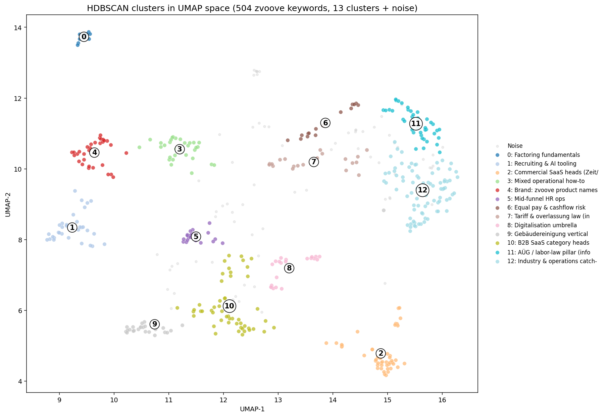

# SEO Keyword Pipeline für zvoove

!!! abstract "Was diese Pipeline macht"
    Aus dem zvoove Blog wird ein priorisiertes Keyword Set, daraus thematische Cluster, daraus Content Briefs, daraus ein interaktives Reporting. Fünf entkoppelte Schritte. Lokale ML, Anthropic API für Briefs, GitHub Pages für die Live Demo.



## Das Problem in einem Satz

Das Ziel ist es, im Bereich Zeitarbeit und Personaldienstleistung organischen Traffic zu gewinnen, der echte Kaufinteressenten bringt. Dafür braucht es eine klare Antwort auf die Frage: Welche Themen lohnen sich wirklich, und in welcher Reihenfolge?

## Schnelle Einstiegspunkte

<div class="grid cards" markdown>

-   :material-map-marker-radius: __Interaktive Cluster Karte__

    13 Themengruppen visuell, mit Klick auf jeden Punkt die Details. Sprache umschaltbar.

    [:octicons-arrow-right-24: Live Demo](https://t1nak.github.io/seo-pipeline/output/clustering/cluster_map.html)

-   :material-file-chart: __Reporting Dashboard__

    KPIs, Cluster Tabelle, Charts, Brief Links auf einer Seite.

    [:octicons-arrow-right-24: Live Demo](https://t1nak.github.io/seo-pipeline/output/reporting/index.html)

-   :material-book-open-variant: __Case Study__

    Vollständige Schreibarbeit mit Architektur, Validierung, Empfehlungen, Reflektion.

    [:octicons-arrow-right-24: Lesen](case-study.md)

-   :material-flask: __Methodik__

    Warum HDBSCAN, warum UMAP, Hyperparameter Sweep, Validierung mit echten Zahlen.

    [:octicons-arrow-right-24: Tiefe](methodology.md)

-   :material-format-list-bulleted: __13 Cluster Katalog__

    Pro Cluster: Stats, Top Keywords, Empfehlung, Aufwand, Revenue Hypothese.

    [:octicons-arrow-right-24: Ergebnisse](results.md)

-   :material-file-tree: __Architektur__

    Datenfluss, Schnittstellen, Revenue Stack Integration, Skalierungs-Verhalten.

    [:octicons-arrow-right-24: Diagramm](architecture.md)

</div>

## Ergebnisse aus dem aktuellen Lauf

<div class="grid" markdown>

`504` Keywords
{ .annotate }

`13` Cluster plus 71 Ausreißer

`240.025` SV pro Monat (geschätzt)

`0,64` Silhouette Score (ohne Rauschen)

`0,75` ARI gegen Ward Hierarchical (k=10)

`~25 s` voller Lauf ohne Briefs

</div>

Die fünf größten Cluster nach Suchvolumen:

| # | Cluster | Keywords | SV / Monat | Ø KD | % komm. |
|---|---|---|---|---|---|
| 11 | B2B-SaaS Kategorie-Heads | 52 | 48.945 | 48 | 77 |
| 3 | Kommerzielle SaaS-Heads (Zeit/Software) | 46 | 26.062 | 48 | 93 |
| 13 | Branche & Betrieb (Sammelbecken) | 82 | 24.589 | 38 | 38 |
| 5 | Marke: zvoove Produktnamen | 32 | 23.432 | 54 | 100 |
| 9 | Digitalisierung allgemein | 22 | 12.979 | 38 | 45 |

[Alle 13 Cluster im Detail :octicons-arrow-right-24:](results.md)

## Aktueller Stand der Pipeline

| Schritt | Stand |
|---|---|
| Discover | Stub. `--source manual` funktioniert, `--source live` ist offen |
| Enrich | Vollständig. Heuristik plus optional DataForSEO Live Lookup |
| Cluster | Vollständig. Embeddings, UMAP, HDBSCAN, 6 Charts, interaktive Karte |
| Brief | Vollständig. Claude API mit Prompt Caching |
| Report | Vollständig. Konsolidiertes HTML Dashboard |

Diese Pipeline läuft end-to-end auf einem zuvor LLM-erzeugten Keyword Set. Der Discover Schritt scrapt den Blog noch nicht live. Das ist transparent dokumentiert in [Entscheidungen](decisions.md) und der nächste hochwertvolle Arbeitsblock.

## Schnellstart

```bash
# Abhängigkeiten installieren
pip install -r requirements.txt

# Komplette Pipeline ausführen
python pipeline.py

# Einzelne Schritte
python pipeline.py --step cluster
python pipeline.py --step brief --dry-run    # ohne Claude API
python pipeline.py --step report
```

Für echte Content Briefs (sonst Stubs) wird ein Anthropic API Key gebraucht:

```bash
export ANTHROPIC_API_KEY=sk-ant-...
python pipeline.py --step brief
```

[Vollständige CLI Referenz im Repo :octicons-arrow-right-24:](https://github.com/t1nak/seo-pipeline#schnellstart)

## Tech Stack auf einen Blick

| Schicht | Werkzeug | Warum |
|---|---|---|
| Embeddings | `paraphrase-multilingual-MiniLM-L12-v2` | mehrsprachig, läuft lokal ohne GPU |
| Reduktion | `umap-learn` | bessere lokale Struktur als PCA für density-based clustering |
| Clustering | `hdbscan` | wählt Clusteranzahl selbst, markiert Ausreißer als Rauschen |
| Vergleich | Ward Hierarchical (`scipy`) | transparente Granularitäts-Kontrolle, ARI als Gegenprobe |
| Visualisierung | `plotly` (interaktiv), `matplotlib` (PNG) | Plotly für Klick-Karte, matplotlib für statische Diagnostik |
| LLM Briefs | `anthropic` SDK, `claude-sonnet-4-6` | mit Prompt Caching auf System Block |
| Live Keyword Daten | DataForSEO Labs API | optional, Heuristik als Default |

## Lizenz und Kontext

Persönliches Case Study Projekt für eine Bewerbung als Revenue AI Architect bei zvoove. Nicht offiziell affiliated.
